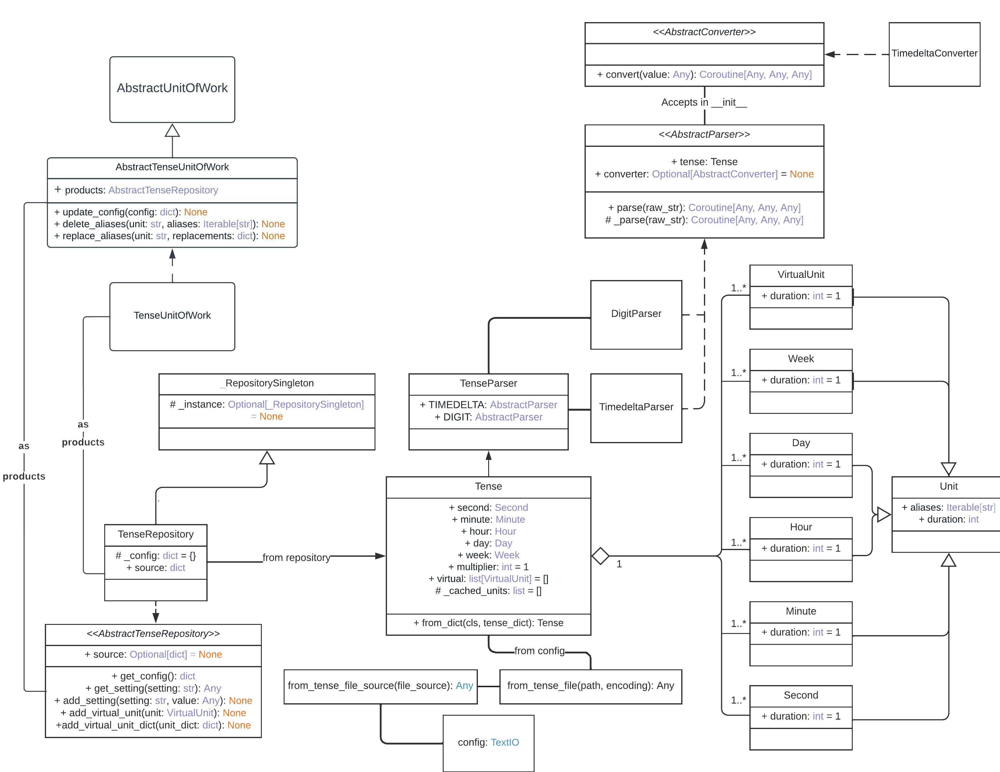

<div id="top"></div>

Проект: aiotense
<br>
Лицензия: Apache 2.0
<br>
Описание: Инструмент для парсинга времени
<br>
OS: Независимый
<br>
Python: 3.10+
<br>
Typing: Аннотирован
<br>
Тема: Утилиты
<br />
    <p align="center">
    <br />
    <a href="https://github.com/othneildrew/Best-README-Template">Документация</a>
    ·
    <a href="https://github.com/Animatea/aiotense/issues">Сообщить о баге</a>
    ·
    <a href="https://github.com/Animatea/aiotense/issues">Предложить идею</a>
    </p>
<div id="top"></div>
<p align="center">
   <a href="i18n/ua_README.md"></a>
   <a href="../README.md"></a>
</p>

<details>
  <summary>Оглавление</summary>
  <ol>
    <li>
      <a href="#о-проекте">О проекте</a>
      <ul>
        <li><a href="#добро-пожаловать">Добро пожаловать</a></li>
      </ul>
    </li>
    <li>
      <a href="#приступить-к-использованию">Приступить к использованию</a>
      <ul>
        <li><a href="#pypi">PyPi</a></li>
        <li><a href="#poetry">Poetry</a></li>
      </ul>
    </li>
    <li>
      <a href="#использование">Использование</a>
      <ul>
        <li><a href="#основные-возможности">Основные возможности</a></li>
        <li><a href="#изменение-существующих-параметров">Изменение существующих параметров</a></li>
        <li><a href="#добавление-новых-настроек">Добавление новых настроек</a></li>
        <li><a href="#faq">FAQ</a></li>
      </ul>
    </li>
    <li><a href="#примеры">Примеры</a></li>
    <li><a href="#вклад-в-проект">Вклад в проект</a></li>
    <li><a href="#лицензия">Лицензия</a></li>
    <li><a href="#контакт">Контакт</a></li>
    <li><a href="#благодарности">Благодарности</a></li>
  </ol>
</details>

## О проекте
### Добро пожаловать
> Нужно ли Вам было конвертировать, например, строку "1д1минута 2 сек" 
в кол-во секунд или обьект datetime.timedelta?

Нет? Тогда посоветуйте наш проект своим друзьям :) Если вы всё ещё здесь - давайте двигаться дальше!

<h5 align="center">Диаграма с основной логикой проекта</h5>


<p align="right"><a href="#top"></a></p>

## Приступить к использованию
### PyPi
```bash
$ pip3 install aiotense
```

### Poetry
```bash
$ poetry add aiotense
```
<p align="right"><a href="#top"></a></p>

## Использование
### Основные возможности
```py
import asyncio
import datetime
from aiotense import TenseParser

time_string = "1d2minutes 5 sec"

# <-- Digit parser -->
digit_parser = TenseParser(TenseParser.DIGIT)
digit_value = asyncio.run(digit_parser.parse(time_string))
# <-- Assertions -->
assert digit_value == 86525

# <-- Timedelta parser -->
delta_parser = TenseParser(TenseParser.TIMEDELTA)
delta_value = asyncio.run(delta_parser.parse(time_string))
# <-- Assertions -->
assert isinstance(delta_value, datetime.timedelta)
assert str(delta_value) == "1 day, 0:02:05"
```
<p align="right"><a href="#top"></a></p>

### Изменение существующих параметров
```py
import asyncio
from aiotense import TenseParser, from_tense_file_source

config_emulation = """
[model.Tense]
multiplier = 2  # секундное значение каждой единицы времени будет умножено на 2
# !!! Уточнение: Если multiplier <= 0, тогда парсеры могут работать некорректно 
# В данном случае будет выслано предупреждение в консоль.

[units.Minute]
duration = 120  # Почему бы и нет?...
aliases = моя_минута, моя_мин, моих_мин, минут
"""
parser = TenseParser(
    TenseParser.TIMEDELTA,
    config=from_tense_file_source(config_emulation),
)
delta_value = asyncio.run(parser.parse("1 моя_мин 10моих_мин 9  минут"))
# <-- Assertions -->
assert str(delta_value) ==  "1:20:00" # (каждая 120 * 2)
```
<p align="right"><a href="#top"></a></p>

### Добавление новых настроек
```py
import asyncio
from aiotense import TenseParser, from_tense_file_source

config_emulation = """
[model.Tense]  # Этот заголовок обязателен.

[units.Year]
duration = exp(year)
aliases = год, лет

[units.Second]
duration = exp(second)
aliases = с, сек, секунд

[virtual]
duration = exp(year * 10)
aliases = десятилетие, десятилетий
"""

parser = TenseParser(
    TenseParser.TIMEDELTA,
    config=from_tense_file_source(config_emulation),
)
delta_value = asyncio.run(parser.parse("1год 10 десятилетий5   секунд"))
# <-- Assertions -->
assert str(delta_value) == "36865 days, 0:00:05"
```
<p align="right"><a href="#top"></a></p>

### FAQ
Но что если нам нужно парсить строку типа: "1day and 10 minutes + 5 seconds"?
Давайте посмотрим:
```py
>>> import asyncio
>>> from aiotense import TenseParser

>>> complex_string = "1day and 10 minutes + 5 seconds"

>>> parser = TenseParser(TenseParser.TIMEDELTA)
>>> asyncio.run(parser.parse(complex_string))
'0:00:05'
```
Подождите... Что? 5 секунд? Но там же дни и минуты...
- Всё окей, вы же используете гибкий aiotense! Проблему решить можно двумя способами:
  1) Вы пишете свой time_resolver
  2) Вы выбираете из уже существующих aiotense.resolvers

Давайте продемонстрирую!
Я буду использовать второй вариант, так как существующие резольверы мне подходят.
```py
>>> import asyncio
>>> from aiotense import TenseParser, resolvers

>>> complex_string = "1day and 10 minutes + 5 seconds"

>>> parser = TenseParser(TenseParser.TIMEDELTA, time_resolver=resolvers.smart_resolver)
>>> asyncio.run(parser.parse(complex_string)) 
'1 day, 0:10:05'
```
Ну, так-то лучше!
<p align="right"><a href="#top"></a></p>

## Примеры
Если Вы думаете, что на этом возможности aiotense заканчиваются, то вы ошибаетесь!
Возможностей aiotense слишком много для README, поэтому я предлагаю вам продолжить просмотр 
примеров использования тут:
<p align="center">
<br />
<a href="https://github.com/Animatea/aiotense/tree/main/examples">Aiotense Примеры</a>
</p>
<p align="right"><a href="#top"></a></p>

## Вклад в проект

Вклады — это то, что делает сообщество с открытым исходным кодом таким замечательным местом для обучения, вдохновения и творчества. Любой ваш вклад **очень ценится**.

Если у вас есть предложение, которое могло бы улучшить это, разветвите репозиторий и создайте запрос на включение. Вы также можете просто открыть вопрос с тегом «enhancement».
Не забудьте поставить звезду проекту! Спасибо ещё раз!

1. Создайте форк проекта
2. Создайте вашу ветку с нововведением (`git checkout -b feature/AmazingFeature`)
3. Подтвердите изменения (`git commit -m 'Add some AmazingFeature'`)
4. Внесите изменения на ветку (`git push origin feature/AmazingFeature`)
5. Создайте пулл реквест
<p align="right"><a href="#top"></a></p>

<!-- LICENSE -->
## Лицензия

Распространяется под лицензией Apache 2.0. См. детальнее [`LICENSE`](https://github.com/Animatea/aiotense/blob/main/LICENSE).

<p align="right"><a href="#top"></a></p>


<!-- CONTACT -->
## Контакт
<div align="left">
    <a href="https://discord.com/invite/KKUFRZCt4f"></a>
</div>

<p align="right"><a href="#top"></a></p>


## Благодарности
* [Choose an Open Source License](https://choosealicense.com)
* [Img Shields](https://shields.io)
* [GitHub Pages](https://pages.github.com)
* [Python](https://www.python.org)
* [Python Community](https://www.python.org/community/)

<p align="right"><a href="#top"></a></p>
