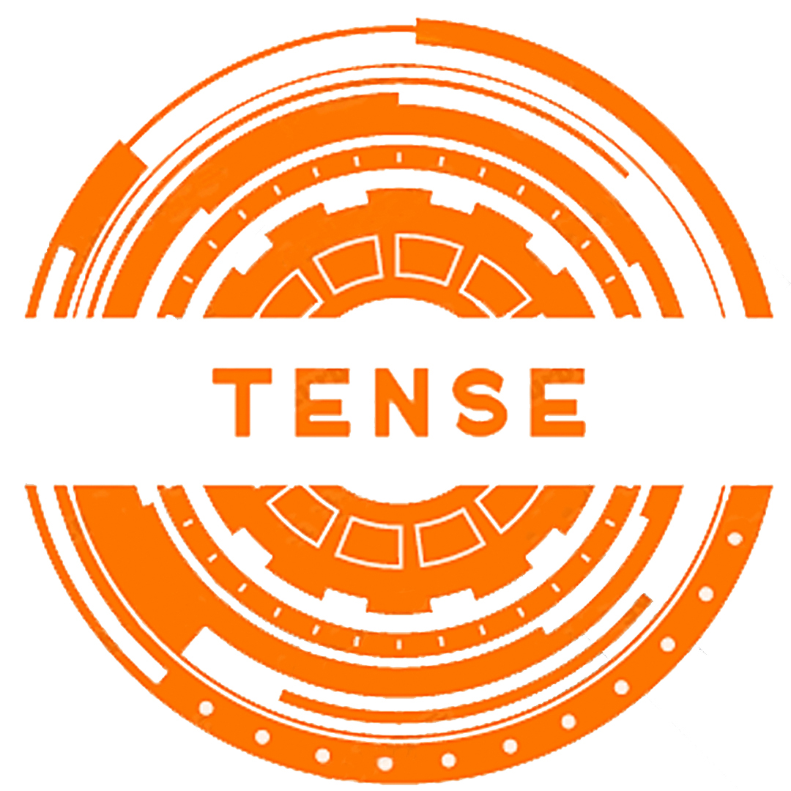

<div id="top"></div>

Проект: tense
<br>
Ліцензія: Apache 2.0
<br>
Опис: Інструмент для парсингу часу
<br>
OS: Незалежний
<br>
Python: 3.9+
<br>
Typing: Annotated
<br>
Тема: Утиліти
<br />
    <p align="center">
    <br />
    <a href="https://github.com/othneildrew/Best-README-Template">Документація</a>
    ·
    <a href="https://github.com/Animatea/tense/issues">Сповістити про баг</a>
    ·
    <a href="https://github.com/Animatea/tense/issues">Запропонувати ідею</a>
    </p>
<div id="top"></div>
<p align="center">
   <a href="../README.md"></a>
   <a href="ru_README.md"></a>
</p>

<details>
  <summary>Зміст</summary>
  <ol>
    <li>
      <a href="#про-проект">Про проект</a>
      <ul>
        <li><a href="#ласкаво-просимо">Ласкаво просимо</a></li>
      </ul>
    </li>
    <li>
      <a href="#перейти-до-використання">Перейти до використання</a>
      <ul>
        <li><a href="#pypi">PyPi</a></li>
        <li><a href="#poetry">Poetry</a></li>
      </ul>
    </li>
    <li>
      <a href="#використання">Використання</a>
      <ul>
        <li><a href="#основні-можливості">Основні можливості</a></li>
        <li><a href="#зміна-наявних-параметрів">Зміна наявних параметрів</a></li>
        <li><a href="#додавання-нових-налаштувань">Додавання нових налаштувань</a></li>
        <li><a href="#faq">FAQ</a></li>
      </ul>
    </li>
    <li><a href="#приклади">Приклади</a></li>
    <li><a href="#вклад-у-проект">Вклад у проект</a></li>
    <li><a href="#ліцензия">Ліцензия</a></li>
    <li><a href="#контакт">Контакт</a></li>
    <li><a href="#подяки">Подяки</a></li>
    <li><a href="#історія">Історія проекту</a></li>
  </ol>
</details>

## Про проект
<a href="https://circleci.com/gh/Animatea/tense/tree/main"></a>
<a href="https://pypi.org/project/tense/"></a>
<a href="https://pypi.org/project/mypy/"></a>
<a href="https://github.com/psf/black"></a>
<a href="https://pycqa.github.io/isort/"></a>

### Ласкаво просимо
> Чи потрібно Вам було конвертувати, наприклад, строку "1д1хвилина 2 сек" 
у кількість секунд або об'єкт datetime.timedelta?

Ні? Тоді порадьте наш проект своїм друзям :) Якщо ви ще тут - йдемо далі!

<p align="right"><a href="#top"></a></p>

## Перейти до використання
### PyPi
```bash
$ pip3 install tense
```

### Poetry
```bash
$ poetry add tense
```
<p align="right"><a href="#top"></a></p>

## Використання
### Основні можливості

```py
import datetime
from tense import TenseParser

time_string = "1d2minutes 5 sec"

# <-- Digit parser -->
digit_parser = TenseParser(TenseParser.DIGIT)
assert digit_parser.parse(time_string) == 86525

# <-- Timedelta parser -->
delta_parser = TenseParser(TenseParser.TIMEDELTA)
delta_value = delta_parser.parse(time_string)
# <-- Assertions -->
assert isinstance(delta_value, datetime.timedelta)
assert str(delta_value) == "1 day, 0:02:05"
```
<p align="right"><a href="#top"></a></p>

### Зміна наявних параметрів

```py
from tense import TenseParser, from_tense_file_source

config_emulation = """
[model.Tense]
multiplier = 2  # секундне значення кожної одиниці часу буде помножене на 2
# !!! Уточнення: Якщо multiplier <= 0, тоді парсери можуть працювати некоректно
# У цьому випадку буде вислано попередження у консоль.

[units.Minute]
duration = 120  # Чом би й ні?...
aliases = хвилина, хвилин, хв
"""
parser = TenseParser(
    TenseParser.TIMEDELTA,
    tenses=from_tense_file_source(config_emulation),
)
delta_value = parser.parse("1 хвилина 10хвилин 9  хв")
assert str(delta_value) == "1:20:00"  # (кожна 120 * 2)
```
<p align="right"><a href="#top"></a></p>

### Додавання нових налаштувань

```py
from tense import TenseParser, from_tense_file_source

config_emulation = """
[model.Tense]  # Цей заголовок обов'язковий.

[units.Year]
duration = exp(year)
aliases = рік,

[units.Second]
duration = exp(second)
aliases = с, сек, секунд

[virtual]
duration = exp(year * 10)
aliases = десятиліття, десятиліть
"""

parser = TenseParser(
    TenseParser.TIMEDELTA,
    tenses=from_tense_file_source(config_emulation),
)
delta_value = parser.parse("1рік 10 десятиліть5   секунд")
assert str(delta_value) == "36865 days, 0:00:05"
```
<p align="right"><a href="#top"></a></p>

### FAQ
Але що як нам потрібно парсити строку типу: "1day and 10 minutes + 5 seconds"?
Давайте подивимось:

```py
>> > from tense import TenseParser

>> > complex_string = "1day and 10 minutes + 5 seconds"

>> > parser = TenseParser(TenseParser.TIMEDELTA)
>> > parser.parse(complex_string)
'0:00:05'
```
Зачекайте... Що? 5 секунд? Але ж там дні та хвилини...
- Все окей, ви ж користуєтесь гнучким tense! Проблему можно вирішити двома шляхами:
  1) Ви пишете свій time_resolver
  2) Ви вибираєте з вже існуючих tense.resolvers

Давайте продемонструю!
Я буду використовувати інший варіант, так як існуючі резольвери мені підходять.

```py
>> > from tense import TenseParser, resolvers

>> > complex_string = "1day and 10 minutes + 5 seconds"

>> > parser = TenseParser(TenseParser.TIMEDELTA, time_resolver=resolvers.smart_resolver)
>> > parser.parse(complex_string)
'1 day, 0:10:05'
```
Ну, так вже краще!

**tense.application.resolvers.smart_resolver()** також не є чутливим до регістру!

```py
>> > from tense import TenseParser, resolvers

>> > complex_string = "1DAY and 10 MINUTES + 5 SECONDS"

>> > parser = TenseParser(TenseParser.TIMEDELTA, time_resolver=resolvers.smart_resolver)
>> > parser.parse(complex_string)
'1 day, 0:10:05'
```
<p align="right"><a href="#top"></a></p>

## Приклади
Якщо ви гадаєте, що на цьмоу можливості tense закінчуються, то ви помиляєтесь!
Можливостей tense забагато для README, тому я пропоную Вам продовжити перегляд 
прикладів використання тут:
<p align="center">
<br />
<a href="https://github.com/Animatea/tense/tree/main/examples">Tense Приклади</a>
</p>
<p align="right"><a href="#top"></a></p>

## Вклад у проект
Вклади – це те, що робить спільнота з відкритим вихідним кодом таким чудовим місцем для навчання, натхнення та творчості. Будь-який ваш внесок дуже цінується.

Якщо у вас є пропозиція, яка могла б покращити це, розгалужіть репозиторій і створіть запит на включення. Ви також можете відкрити питання з тегом «enhancement».
Не забудьте поставити зірку проекту! Дякую ще раз!

1. Зробіть форк проекта
2. Зробіть вашу гілку з нововведеннями (`git checkout -b feature/AmazingFeature`)
3. Затвердіть зміни (`git commit -m 'Add some AmazingFeature'`)
4. Внесіть зміни на гілку (`git push origin feature/AmazingFeature`)
5. Зробіть пул реквест
<p align="right"><a href="#top"></a></p>

<!-- LICENSE -->
## Ліцензия

Поширюється під ліцензією Apache 2.0. Див. детальніше [`LICENSE`](https://github.com/Animatea/tense/blob/main/LICENSE).

<p align="right"><a href="#top"></a></p>


<!-- CONTACT -->
## Контакт
<div align="left">
    <a href="https://discord.com/invite/KKUFRZCt4f"></a>
</div>

<p align="right"><a href="#top"></a></p>


## Подяки
* [Choose an Open Source License](https://choosealicense.com)
* [Img Shields](https://shields.io)
* [GitHub Pages](https://pages.github.com)
* [Python](https://www.python.org)
* [Python Community](https://www.python.org/community/)
* [MkDocs](https://www.mkdocs.org)
* [MkDocs Material](https://squidfunk.github.io/mkdocs-material/)

<p align="right"><a href="#top"></a></p>

## Історія
Спочатку проект був зроблений асинхронним, що суттєво уповільнювало процес парсингу, адже tense є CPU-bound модулем.

Відрефакторивши проект, ми отримали `~x22.31` прискорення в обробці складних рядків (за допомогою `smart_resolver`).
> Було: `~0.00095030...`μs | Стало: `~0.00004260...`μs

І `~x38.28` прискорення в обробці простих рядків, відповідно (за допомогою `basic_resolver`).
> Було: `~0.00062400...`μs | Стало: `~0.00001630...`μs

Попередня (асинхронна) версія, як і раніше, доступна у гілках репозиторію - https://github.com/Animatea/tense/tree/async-final,
але сайт із документацією буде змінено.

<p align="right"><a href="#top"></a></p>
